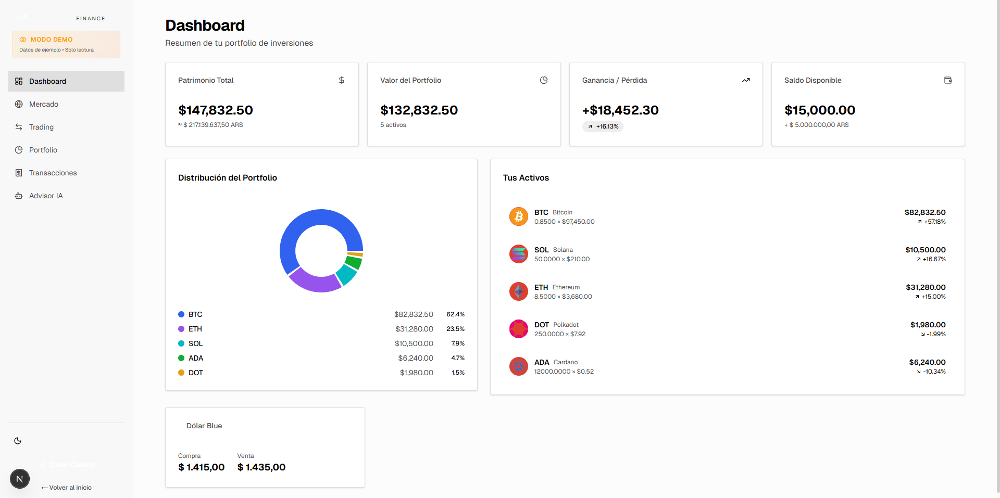
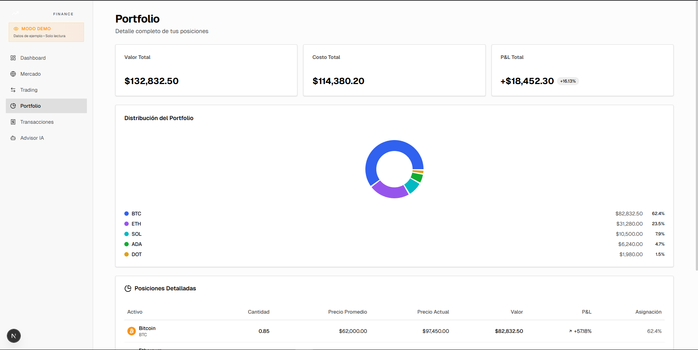
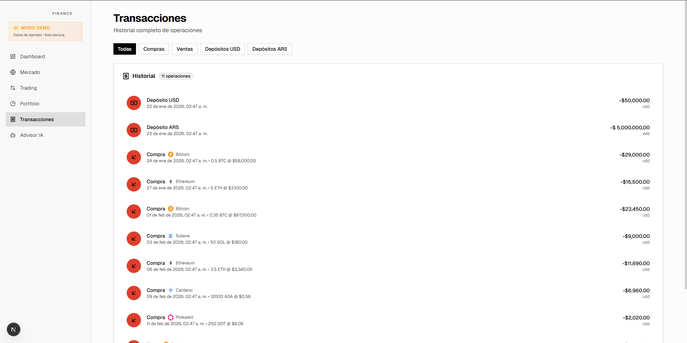

# 💰 Horizon Finance - Plataforma de Inversión y Gestión Financiera

Horizon Finance es una aplicación robusta de tecnología financiera (Fintech) diseñada para ayudar a los usuarios a gestionar activos, visualizar rendimientos y administrar sus finanzas personales con una interfaz profesional y segura.

---

## 🖼️ Vista Previa del Proyecto

| Panel de Inversiones | Análisis de Cartera | Historial de Transacciones |
| :---: | :---: | :---: |
|  |  |  |


## 🚀 Características Principales

* **Dashboard Financiero:** Visualización clara de saldos, ingresos y egresos mediante gráficos interactivos.
* **Gestión de Activos:** Módulo para el seguimiento de inversiones y rendimientos en tiempo real.
* **Historial Inteligente:** Registro detallado de movimientos financieros con filtros avanzados.
* **Seguridad de Datos:** Implementación de prácticas seguras para el manejo de información sensible y estados financieros.
* **Interfaz de Alta Gama:** Diseño limpio y profesional enfocado en la confianza del usuario (UI/UX).

## 🛠️ Stack Tecnológico

* **Frontend:** Next.js (App Router), TypeScript, Tailwind CSS.
* **Gráficos:** [Recharts / Chart.js - especificar la librería que usaste] para la visualización de datos.
* **Base de Datos:** PostgreSQL con Prisma ORM (Manejo de relaciones complejas entre usuarios y transacciones).
* **Autenticación:** [Clerk / NextAuth - especificar].
* **Despliegue:** Vercel.

---

## 📐 Valor Agregado para Clientes (Freelance)
Este proyecto demuestra mi capacidad para construir herramientas críticas donde la precisión es lo más importante:
1.  **Manejo de Datos Complejos:** Experiencia procesando cálculos financieros y relaciones de datos en la DB.
2.  **Visualización de Datos:** Capacidad para transformar números crudos en gráficos fáciles de entender para el cliente final.
3.  **Rendimiento:** Optimización de consultas para asegurar que la información financiera cargue al instante.

---

<details>
  <summary>🛠️ <b>Instrucciones de Instalación (Técnico)</b></summary>

### Configuración local:

1.  **Clonar:**
    ```bash
    git clone [https://github.com/AndressCoronel/Horizon-Finance.git](https://github.com/AndressCoronel/Horizon-Finance.git)
    cd Horizon-Finance
    ```

2.  **Instalar:** `npm install`
3.  **Variables de Entorno:** Configurar `.env` con las credenciales de la DB y Auth.
4.  **Prisma:** `npx prisma generate` y `npx prisma db push`.
5.  **Ejecutar:** `npm run dev`
</details>

---
Desarrollado por **[Andres Coronel](https://github.com/AndressCoronel)** *Desarrollador Full-Stack especializado en soluciones Fintech.*